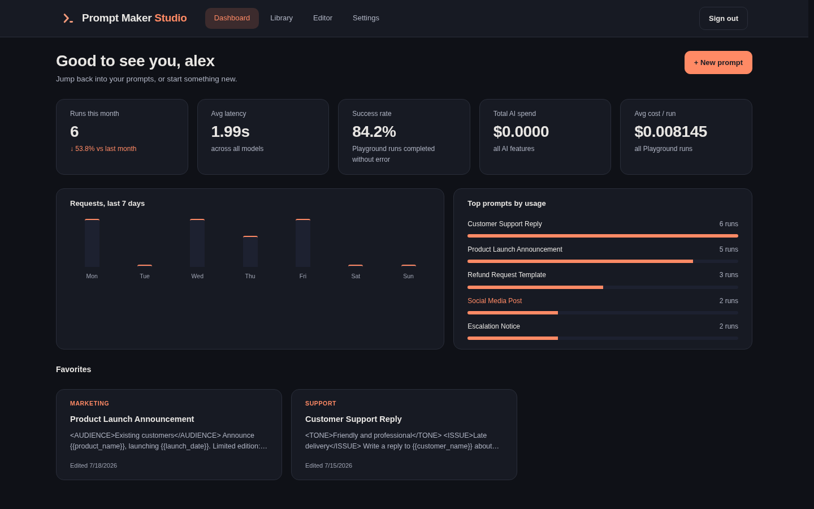
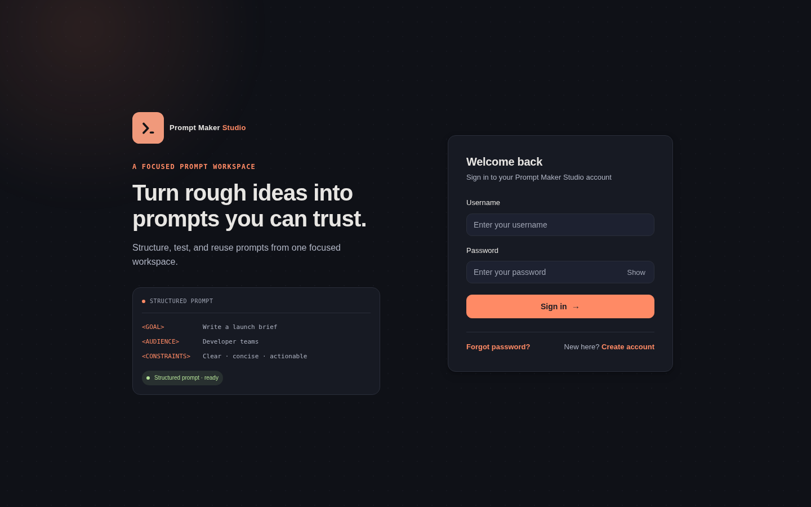
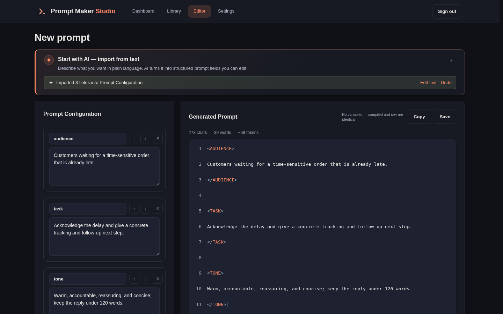
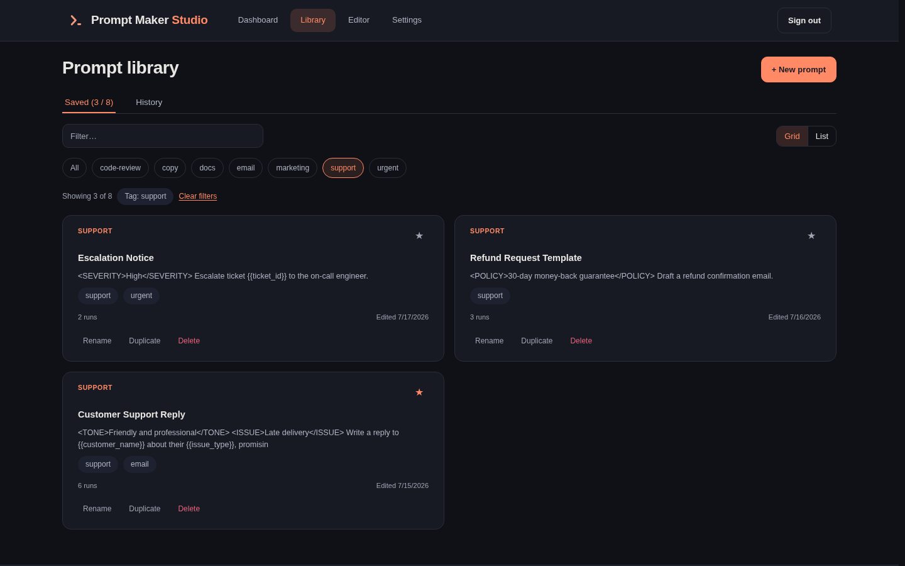
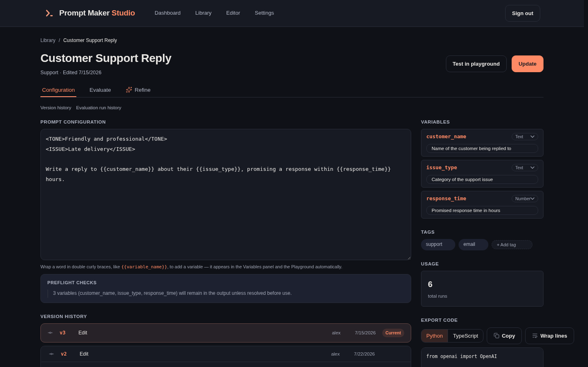
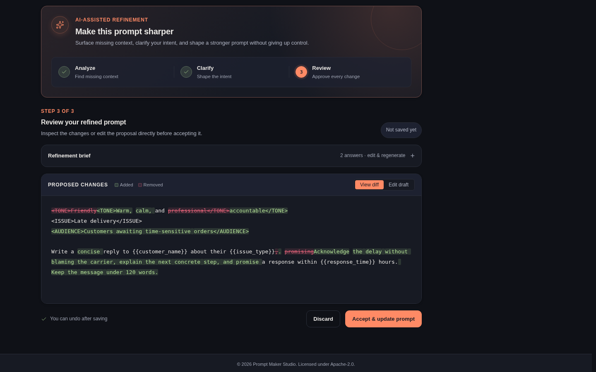
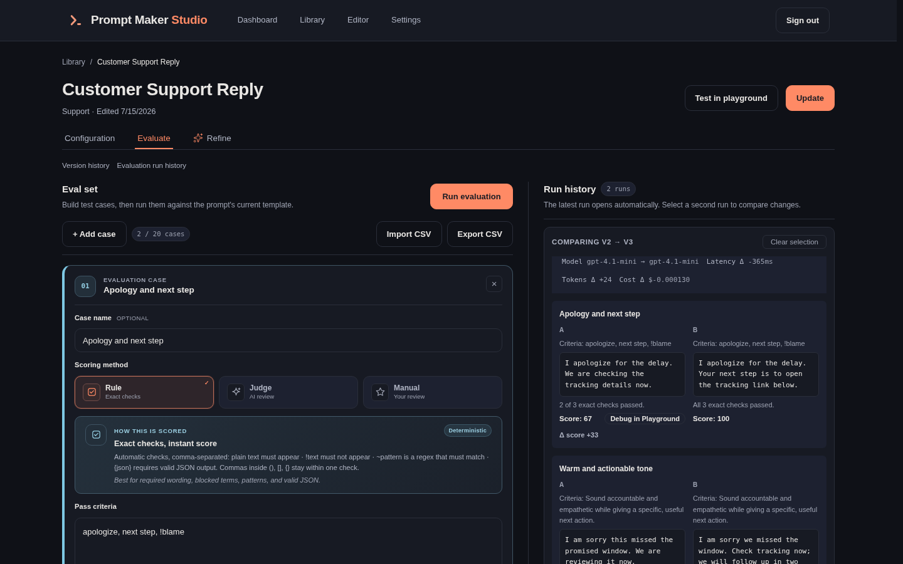

# Prompt Maker Studio

A self-hosted workspace for creating, testing, evaluating, refining, versioning, and reusing structured AI prompts. Prompt Maker Studio combines a FastAPI backend, a Next.js frontend, SQLite persistence, optional Prometheus/Grafana monitoring, and bring-your-own LLM provider integration — OpenAI, Anthropic, Google Gemini, a self-hosted Ollama or vLLM server, or any OpenAI-compatible endpoint.

[](./LICENSE)
[](https://github.com/chrysogonus/prompt-maker-studio/actions/workflows/ci.yml)
[](https://www.python.org/downloads/)
[](https://nodejs.org/)

## Screenshots



**Dashboard** — usage trends, model performance, top prompts, and favorites at a glance.

| | |
|---|---|
|  |  |
| **Login** — secure account access with registration and password recovery. | **New Prompt** — turn plain-language intent into editable fields and a structured preview. |
|  |  |
| **Library** — organize, filter, favorite, duplicate, rename, and reuse saved prompts. | **Editor** — configure variables and metadata, track versions, and export integration code. |
|  |  |
| **Refine** — clarify intent and review every proposed change before saving. | **Evaluation** — score repeatable cases and compare outputs, quality, latency, tokens, and cost. |

> All captures use isolated synthetic demo data. `make screenshots` rebuilds the seven images without contacting an external LLM provider.

## Project status

**Early — expect breaking changes.** Prompt Maker Studio is at `0.x`, maintained by a
single author, and has been running in production for exactly one deployment.
While the major version is `0`:

- The REST API, database schema, and configuration variables may change in any release.
- There is no supported upgrade path between `0.x` versions. Back up your SQLite database (`make backup-db`) before pulling.
- Each user brings their own LLM provider credential; the instance operator does not supply one. Stored keys are encrypted at rest — read the security notes before exposing an instance publicly.

Bug reports and issues are welcome. Please read [CONTRIBUTING.md](./CONTRIBUTING.md)
before opening a pull request.

## Features

- **User Authentication**: JWT-based registration and login with sliding session renewal; all prompt data is securely scoped per user.
- **Dashboard**: Real usage analytics (runs this month, avg latency, success rate, 7-day request volume, top prompts by usage) plus a Favorites grid — computed from real runtime data.
- **Library**: Grid and list views of saved prompts with search, tag filtering, folder labels, favoriting, rename/duplicate/delete, and a separate paginated/searchable History tab.
- **Dynamic Fields & Starter Kits**: Compose a prompt from named fields or initialize from curated presets (Role–Task–Context, Chain-of-Thought, Persona).
- **AI-Powered Import**: Paste free-form text and let your configured model automatically decompose it into structured fields.
- **XML Output Format**: Fields are compiled into an XML-tagged prompt template block (e.g. `<GOAL>…</GOAL>`).
- **Editor & Versioning**: Edit templates directly, configure variable metadata and types, inspect preflight warnings, compare/restore versions, and export Python or TypeScript integration snippets.
- **Preflight Checks**: Advisory warnings flag unresolved variables, malformed XML, empty sections, stale metadata, and large prompt sizes before copying or running.
- **Playground**: Run saved prompts against your connected provider's models, inspect latency, token count, and cost breakdown, and replay inputs from paginated run history.
- **Evaluation**: Maintain rule-based, AI-judge, or manual test cases; import/export CSV datasets; generate reviewable cases with AI; execute test runs and compare outputs across prompt versions.
- **AI Refinement**: Answer clarifying questions, review AI-proposed revisions as word-level diffs, and accept revisions as reversible new prompt versions.
- **Tags, Favorites & Folder Labels**: Organize prompts with tags and favorites; display and search API-provided folder labels in the Library.
- **Settings & Preferences**: Manage user profile, UI theme, layout density, model/eval defaults, automated evaluation triggers, email notification toggles, cron-invoked weekly summaries, API status check, and full JSON data export.
- **Bring Your Own Provider**: Connect OpenAI, Anthropic, Google Gemini, a self-hosted Ollama or vLLM server, or any OpenAI-compatible endpoint. Your key is stored encrypted and used for every AI feature; you are billed by your provider directly.
- **Cost Guardrails**: Optional global and per-user monthly spend ceilings cap how much billed activity the instance will drive, across import, Playground, evaluation, eval-case generation, and refinement.
- **Automated Quality Gates**: Full-history and working-tree secret scanning, backend coverage enforcement (90%), frontend Vitest component tests with enforced coverage floors, Playwright browser E2E tests, Ruff & ESLint checks, Bandit & CodeQL static analysis, pip-audit & npm audit dependency scans, Compose validation, and Docker container smoke tests.

## Architecture

```
prompt-maker-studio/
├── backend/           # FastAPI backend (Python 3.12)
│   ├── app/
│   │   ├── api/       # Auth, prompt, eval, refine, analytics, and admin routes
│   │   ├── auth/      # JWT + bcrypt utilities, dependencies, and token logic
│   │   ├── database/  # SQLAlchemy session engine and custom migration runner
│   │   ├── models/    # Prompt, version, Playground run, eval, and user ORM models
│   │   └── services/  # LLM client/providers, compilation, eval, refine, analytics, email
│   ├── migrations/    # Historical reference SQL migrations
│   ├── scripts/       # Demo-data and weekly-summary operator jobs
│   ├── tests/         # pytest unit and integration test suite
│   ├── pyproject.toml # Dependencies, Ruff, Bandit, Coverage, and pytest configuration
│   └── run.py         # Uvicorn entry point
├── frontend/          # Next.js frontend (React 18 / TypeScript 6)
│   ├── src/
│   │   ├── app/       # App Router pages: authenticated shell (dashboard, library, editor, playground, settings)
│   │   ├── components/# Feature UI components and shared design primitives
│   │   ├── lib/       # API client, auth service, and variable-placeholder utilities
│   │   └── types/     # TypeScript interfaces and schemas
│   └── package.json   # Dependencies, scripts, and Vitest/Playwright config
├── docs/              # System architecture, deployment, docker, auth, and saved-prompts documentation
├── product/           # Product specs, vision, roadmap, decisions log, and backlog
├── monitoring/        # Prometheus and Grafana service configurations
└── scripts/           # Dependency-light SQLite backup/restore utilities
```

## Prerequisites

- **Docker & Docker Compose** (recommended for quick start and containerized runtime)
- **Node.js 22** (`frontend/.nvmrc` pins 22.14.0) & **Python 3.12** (for non-Docker local development)
- **An LLM provider account** (OpenAI, Anthropic, Gemini, …) *or* a self-hosted Ollama/vLLM server — configured per user in the app, not in `.env`. Optional to start; required for all AI-backed features
- **SMTP Credentials** (optional, required for password resets, notifications, and weekly summaries)

## Quick Start with Docker

```bash
# 1. Create local configuration with a freshly generated SECRET_KEY
make setup
```

The default local stack is ready to start immediately. `make setup` replaces
the public `SECRET_KEY` placeholder automatically, and browser API calls stay
same-origin through the frontend proxy, so `CORS_ORIGINS` does not need a local
override.

If you want to test password-reset emails locally, make their links point back
to the local frontend:

```ini
FRONTEND_URL=http://localhost:3000
```

No LLM API key goes in `.env` — AI access is **bring your own**. After
registering, open Settings → API access and connect a provider (OpenAI,
Anthropic, Google Gemini, a self-hosted Ollama or vLLM server, or any
OpenAI-compatible endpoint) with your own key. Every AI-backed feature —
import, Refine, Playground, evaluation, eval-case generation — runs against
that connection and is billed to you by that provider.

> The frontend calls `/api` on whatever origin serves it, so there is no API
> URL to configure and the same image works on any domain. Compose routes that
> path to the backend for you.

```bash
# 2. Start all services with Docker Compose (builds containers if needed)
make up
```

Once running, access the services at:
- **Frontend App**: http://localhost:3000
- **Backend API**: http://localhost:8000
- **API Documentation**: http://localhost:8000/docs

Those direct development ports bind to `127.0.0.1`. For deliberate testing
from another device on a trusted LAN, set `DEV_BIND_ADDRESS=0.0.0.0`; doing so
also exposes the backend and its API documentation directly to that network.

Caddy is **not** part of the default local stack either. It is the production
edge: it claims host ports 80 and 443 and requests a TLS certificate for
whatever `DOMAIN` holds, which is a placeholder until you deploy. Production is
unaffected — `docker compose -f docker-compose.yml up -d` starts it with no
extra flag, because deployments do not load `docker-compose.override.yml`. To
exercise the reverse proxy locally, point `DOMAIN` at this host and run
`docker compose --profile caddy up -d`.

Prometheus and Grafana are **not** part of the default stack — they are large
third-party images carrying upstream advisories this project cannot fix. Start
them deliberately with `docker compose --profile monitoring up -d`, which needs
`GRAFANA_ADMIN_PASSWORD` in `.env` and binds both to loopback only
(`127.0.0.1:9090` and `127.0.0.1:3010`). See [docs/deployment.md](./docs/deployment.md).

To stop the containers:
```bash
make down
```

To rebuild and restart after making code changes:
```bash
make sync-restart
```

## Configuration

Docker Compose reads configuration from `.env` at the repository root. Copy
`.env.example` to create it (`make setup` does this for you). The file stays on
the host: it is not mounted into application containers, and the frontend
build receives no build arguments at all.

> **Note:** `.env.example` contains production-shaped domain and email
> placeholders, but they do not prevent the direct local frontend/backend ports
> from working. Set `FRONTEND_URL=http://localhost:3000` when testing reset
> emails; review every production/profile-specific setting before deployment.

| Variable | Required | Description | Example / Default |
|---|---|---|---|
| `DATABASE_URL` | No | SQLite database URI, for **non-Docker local runs only**. The Compose stack ignores it and always uses `sqlite:////app/data/prompts.db`, the persistent `backend-data` volume | `sqlite:///./prompts.db` |
| `SECRET_KEY` | Yes | Key used to sign JWT tokens. Generate with `openssl rand -hex 32` (`make setup` does it for you). The backend **refuses to start** on any placeholder this repository has published, or on a key shorter than 32 characters | `4f8c…` |
| `ACCESS_TOKEN_EXPIRE_MINUTES` | No | JWT access token expiration time in minutes | `30` |
| `COOKIE_DOMAIN` | No | Cookie domain override. Leave unset for the default same-origin topology so cookies remain host-only | — |
| `COOKIE_SECURE` | Production | Marks session and CSRF cookies HTTPS-only. Defaults to `true`; the local Compose override sets `false` for plain HTTP | `true` |
| `CORS_ORIGINS` | No | Comma-separated allowed frontend origins. Unused in the Caddy topology, where browser calls to `/api` are same-origin; needed only when a frontend on another origin talks to this backend | `http://localhost:3000` |
| `REGISTRATION_MODE` | No | `closed` (default) or `open`. Closed still admits the first account, then locks; open lets anyone who can reach the instance sign up | `closed` |
| `ALLOW_PRIVATE_LLM_URLS` | No | Permit provider base URLs resolving to private/loopback/link-local addresses. Required for self-hosted Ollama or vLLM; off by default because it is an SSRF primitive for anyone holding an account | `false` |
| `FORWARDED_ALLOW_IPS` | No | Trusted reverse-proxy IP CIDRs for rate limiting | `10.0.0.0/8,172.16.0.0/12,192.168.0.0/16` |
| `LLM_ENCRYPTION_KEY` | No | Fernet key encrypting each user's stored provider API key. Defaults to a value derived from `SECRET_KEY`; set it explicitly to rotate JWT signing without invalidating stored credentials | `gAAAAA…` |
| `LLM_PRICING_REFRESH` | No | Fetch published model prices from a pinned revision of LiteLLM's index (the only outbound request not to your own provider or SMTP server). `false` uses the compiled-in snapshot only | `true` |
| `LLM_PRICING_URL` | No | Override the pricing document URL, e.g. an internal mirror | — |
| `LLM_TIMEOUT_SECONDS` | No | Overrides the per-request provider timeout. Defaults: 30s hosted, 180s self-hosted | `180` |
| `FRONTEND_URL` | For Email | Public frontend base URL used in password-reset email links | `http://localhost:3000` |
| `SMTP_HOST` | For Email | SMTP server hostname for outbound emails | `smtp.example.com` |
| `SMTP_PORT` | For Email | SMTP server port | `587` |
| `SMTP_TLS_MODE` | No | `starttls` (default) or `implicit` for a TLS-on-connect port such as 465. Certificates are always verified | `starttls` |
| `SMTP_USER` | For Email | SMTP authentication username | `user@example.com` |
| `SMTP_PASSWORD` | For Email | SMTP authentication password | `secret` |
| `SMTP_FROM` | For Email | Sender address header for outbound emails | `Prompt Maker Studio <no-reply@example.com>` |
| `DOMAIN` | Production | Domain for Caddy automatic TLS. Serves both the app and the API (`/api`) | `prompts.example.com` |
| `API_PROXY_TARGET` | No | Where the Next server forwards `/api` when no reverse proxy handles it first. Unused behind Caddy | `http://backend:8000` |
| `FRONTEND_PORT` | No | Host port mapped to frontend in local Compose stack | `3000` |
| `BACKEND_PORT` | No | Host port mapped to backend in local Compose stack | `8000` |
| `DEV_BIND_ADDRESS` | Local | Interface for direct development ports. Keep loopback unless intentionally testing from another device on a trusted LAN | `127.0.0.1` |
| `GRAFANA_ADMIN_PASSWORD` | Monitoring | Grafana admin password. Required only when starting the opt-in `monitoring` profile | `local-grafana-password` |
| `GLOBAL_MONTHLY_BUDGET_USD` | No | Global usage guardrail in estimated USD across all users | `50` |
| `USER_MONTHLY_BUDGET_USD` | No | Per-user usage guardrail in estimated USD | `5` |
| `ADMIN_DIAGNOSTICS_TOKEN` | No | Token protecting the operator `/api/admin/smtp/check` endpoint; the endpoint returns 503 while unset | `local-diagnostics-token` |
| `REGISTER_RATE_LIMIT` | No | SlowAPI rate limit applied to the registration endpoint | `5/minute` |
| `LOGIN_RATE_LIMIT` | No | SlowAPI rate limit applied to the login endpoint | `10/minute` |
| `BACKUP_INTERVAL_SECONDS` | Backup Profile | Frequency in seconds for the automated database backup worker | `86400` |
| `BACKUP_UID` | Backup Profile | Numeric host UID used by the non-root scheduled backup worker | `1000` |
| `BACKUP_GID` | Backup Profile | Numeric host GID used by the non-root scheduled backup worker | `1000` |
| `UVICORN_RELOAD` | Process env | Enable Uvicorn autoreload when exported for `make dev-backend` | `false` |
| `GHCR_OWNER` | Production | GitHub user or org owning the published container images (`docker-compose.prod.yml`) | `chrysogonus` |
| `IMAGE_TAG` | Production | Pinned image tag deployed by `docker-compose.prod.yml` | `sha-a1b2c3d` |

See [docs/docker.md](./docs/docker.md) and [docs/deployment.md](./docs/deployment.md) for production configuration guidance.

## Local Development (Without Docker)

### Backend Setup

1. Create and activate a Python 3.12 virtual environment.

   The backend requires Python **3.12 or newer** (`requires-python = ">=3.12"`).
   Many distributions still ship an older `python3` — Ubuntu 22.04 ships 3.10 —
   so name the interpreter explicitly rather than relying on `python3`:

```bash
python3.12 --version        # must print 3.12.x or newer
python3.12 -m venv .venv
source .venv/bin/activate
```

2. Upgrade the packaging tools, then install from the lock file:
```bash
python -m pip install --upgrade pip setuptools wheel
python -m pip install -r backend/requirements-dev.lock
python -m pip install -e "backend/" --no-deps
```

   Installing from `backend/requirements-dev.lock` pins the full transitive
   set, so your environment matches CI and the published images. Regenerate it
   with `make lock` after changing a dependency in `backend/pyproject.toml`.

   Verify the dev extras actually landed — without them `make test` and
   `make lint-backend` fail later with a confusing `No module named pytest`:

```bash
python -c "import pytest, ruff, bandit; print('dev extras OK')"
```

   > If you see `requires a different Python: 3.10.x not in '>=3.12'`, the venv
   > was built with the wrong interpreter. Delete `.venv` and redo step 1 with
   > `python3.12`. The `make install` and `make setup-venv` targets probe for
   > Python 3.12+ and fail with a clear message when no compatible interpreter
   > is available.

3. Export the backend settings required by your local process, then start it.
   The backend deliberately does not load the repository's Compose `.env`
   because that file also contains credentials for unrelated services:
```bash
export SECRET_KEY="$(openssl rand -hex 32)"
# Optional: correct reset-email links during local SMTP testing
export FRONTEND_URL="http://localhost:3000"
make dev-backend
```
The API server runs at http://localhost:8000.

### Frontend Setup

1. Install Node.js dependencies:
```bash
cd frontend
npm install
```

2. Point the dev server's `/api` proxy at your local backend, then start it:
```bash
printf 'API_PROXY_TARGET=http://localhost:8000\n' > .env.local
npm run dev
```
`API_PROXY_TARGET` is read by the Next server, not the browser — requests stay
same-origin on :3000, so CORS is not involved in local development either.
The frontend dev server runs at http://localhost:3000.

Alternatively, initialize both environments from the repository root with:
```bash
make install
```

## Running Tests & Quality Gates

| Command | Description |
|---|---|
| `make setup-venv` | Create/reuse `.venv` with Python 3.12+ and install backend development tools |
| `make check-locks` | Verify installed backend packages and committed lock freshness |
| `make test` | Run backend unit and integration tests using pytest |
| `make test-cov` | Run backend pytest suite with 90% coverage enforcement |
| `make test-frontend` | Run frontend component tests using Vitest, enforcing the coverage floors in `frontend/vitest.config.ts` |
| `make setup-e2e` | Install locked frontend dependencies and Playwright Chromium |
| `make test-e2e` | Run Playwright E2E browser tests against an isolated Compose stack |
| `make lint-backend` | Run Ruff check and code formatting checks |
| `make lint-frontend` | Run TypeScript (`tsc`) and ESLint checks |
| `make lint-fix` | Mutate backend/frontend files to apply Ruff and ESLint fixes |
| `make ci-local` | Execute the complete local CI suite; first run `make setup-venv` and `make setup-e2e`, and ensure Docker is running |

## Project Structure

```
prompt-maker-studio/
├── backend/                  # FastAPI web application and test suite
├── frontend/                 # Next.js 16 Web UI and E2E test suite
├── docs/                     # System architecture, deployment, and auth documentation
│   ├── authentication.md     # JWT auth, sliding sessions, and security spec
│   ├── deployment.md         # VM, Caddy, SSL, and production deployment guide
│   ├── development.md        # Local development setup and DB management
│   ├── docker.md             # Docker Compose topology and environment setup
│   └── saved-prompts.md      # Saved prompts and versioning specification
├── product/                  # Product management documentation
│   ├── VISION.md             # Product goals, users, value, and non-goals
│   ├── FEATURES.md           # Source of truth for implemented features
│   ├── DECISIONS.md          # Architectural and product decisions log
│   ├── ROADMAP.md            # Current horizons and completed milestones
│   ├── BACKLOG.md            # Prioritized feature backlog
│   └── USER-STORIES.md       # Personas, implemented stories, and acceptance criteria
├── monitoring/               # Prometheus & Grafana service configurations
├── scripts/                  # SQLite backup and restore utilities
├── Makefile                  # Main developer command interface
├── docker-compose.yml        # Base Docker Compose service stack
└── README.md                 # Primary developer reference guide
```

## API Reference Overview

All data endpoints require authentication. Browsers use the httpOnly session
cookie set by `/api/auth/login` (plus an `X-CSRF-Token` header on writes);
scripts and CI can still send `Authorization: Bearer <token>`. See
[docs/authentication.md](docs/authentication.md).

### Authentication Endpoints

| Method | Endpoint | Auth Required | Description |
|---|---|---|---|
| `POST` | `/api/auth/register` | No | Register new user account |
| `POST` | `/api/auth/login` | No | Authenticate user and issue JWT token |
| `POST` | `/api/auth/refresh` | Yes | Renew valid JWT token (sliding session) |
| `POST` | `/api/auth/logout` | No | End the current session by clearing its cookies. Deliberately unauthenticated so signing out works with an already-expired token |
| `POST` | `/api/auth/logout-all` | Yes | Invalidate every session for this account, including the caller's |
| `GET` | `/api/auth/me` | Yes | Retrieve current user profile and settings |
| `PATCH` | `/api/auth/me` | Yes | Update profile email, username, or settings preferences |
| `DELETE` | `/api/auth/me` | Yes | Delete user account and every row it owns. Requires the account password in the body |
| `GET` | `/api/auth/me/llm-connection` | Yes | Read the caller's LLM provider connection and the selectable-provider catalogue (never returns the API key) |
| `GET` | `/api/auth/me/llm-connection/models` | Yes | List models exposed by the caller's provider with estimated input/output pricing; Anthropic uses its static compatibility list |
| `PUT` | `/api/auth/me/llm-connection` | Yes | Create or replace the provider, base URL, model, and API key |
| `DELETE` | `/api/auth/me/llm-connection` | Yes | Disconnect the provider and erase the stored key |
| `POST` | `/api/auth/me/llm-connection/test` | Yes | Send a tiny probe to verify the configured endpoint, key, and model |
| `POST` | `/api/auth/change-password` | Yes | Change password after verifying current password; revokes all other sessions |
| `POST` | `/api/auth/forgot-password` | No | Initiate password reset email flow |
| `POST` | `/api/auth/reset-password` | No | Complete password reset using token; revokes every session |

### Prompt Endpoints

| Method | Endpoint | Auth Required | Description |
|---|---|---|---|
| `POST` | `/api/prompts/parse-text` | Yes | Decompose natural language text into structured prompt fields |
| `POST` | `/api/prompts/generate` | Yes | Compile fields into XML prompt and persist to database |
| `GET` | `/api/prompts/config` | Yes | Query the caller's own AI provider connection state, model list, and budget limits |
| `GET` | `/api/prompts/saved` | Yes | List saved prompts (supports `tag`, `folder`, `favorite_only` filters) |
| `GET` | `/api/prompts/tags` | Yes | Retrieve distinct user tags |
| `GET` | `/api/prompts/folders` | Yes | Retrieve distinct user folder names |
| `GET` | `/api/prompts/export` | Yes | Download complete JSON export of user prompts and version history |
| `GET` | `/api/prompts/history` | Yes | Search and paginate prompt creation history |
| `GET` | `/api/prompts/{id}` | Yes | Fetch single prompt by ID |
| `PATCH` | `/api/prompts/{id}` | Yes | Update prompt content (auto-snapshots version; supports optimistic locking) |
| `DELETE` | `/api/prompts/{id}` | Yes | Permanently delete a prompt and its dependent history |
| `POST` | `/api/prompts/{id}/duplicate` | Yes | Duplicate existing prompt |
| `GET` | `/api/prompts/{id}/versions` | Yes | Fetch version history for a prompt |
| `POST` | `/api/prompts/{id}/versions/{version_id}/restore` | Yes | Restore previous prompt version |
| `POST` | `/api/prompts/{id}/playground/run` | Yes | Execute prompt template in Playground against selected model |
| `GET` | `/api/prompts/{id}/playground/runs` | Yes | Retrieve historical Playground execution runs |

### Evaluation & Refinement Endpoints

| Method | Endpoint | Auth Required | Description |
|---|---|---|---|
| `GET` | `/api/prompts/{id}/eval/cases` | Yes | List evaluation test cases |
| `POST` | `/api/prompts/{id}/eval/cases` | Yes | Create new evaluation test case |
| `PATCH` | `/api/prompts/{id}/eval/cases/{case_id}` | Yes | Modify existing test case |
| `DELETE` | `/api/prompts/{id}/eval/cases/{case_id}` | Yes | Delete test case |
| `GET` | `/api/prompts/{id}/eval/cases/export` | Yes | Export evaluation test cases to CSV |
| `POST` | `/api/prompts/{id}/eval/cases/import` | Yes | Import evaluation test cases from CSV |
| `POST` | `/api/prompts/{id}/eval/cases/generate` | Yes | Generate reviewable AI test cases |
| `POST` | `/api/prompts/{id}/eval/runs` | Yes | Execute evaluation suite |
| `GET` | `/api/prompts/{id}/eval/runs` | Yes | List past evaluation execution runs |
| `POST` | `/api/prompts/{id}/eval/runs/{run_id}/results/{result_id}/rate` | Yes | Submit manual 1-5 star rating on eval result |
| `POST` | `/api/prompts/{id}/refine/questions` | Yes | Generate clarifying questions for prompt improvement |
| `POST` | `/api/prompts/{id}/refine/draft` | Yes | Generate draft revision from answered questions |

### Analytics & Admin Endpoints

| Method | Endpoint | Auth Required | Description |
|---|---|---|---|
| `GET` | `/api/analytics/dashboard` | Yes | Fetch user dashboard metrics and usage statistics |
| `POST` | `/api/admin/smtp/check` | Admin Token | Validate SMTP connectivity (requires `X-Admin-Token` header) |

## Additional Documentation

- [backend/README.md](./backend/README.md) — Backend architecture, service boundaries, and contributor conventions
- [frontend/README.md](./frontend/README.md) — Frontend routes, state boundaries, component structure, and test layout
- [docs/development.md](./docs/development.md) — Detailed guide for local setup, testing, and SQLite administration
- [docs/docker.md](./docs/docker.md) — Docker Compose architecture, volume mapping, and container configuration
- [docs/deployment.md](./docs/deployment.md) — Production VM setup, Caddy reverse proxy, TLS, and backup management
- [docs/authentication.md](./docs/authentication.md) — Complete JWT authentication flow, token refresh, and security controls
- [docs/saved-prompts.md](./docs/saved-prompts.md) — Saved prompts features, optimistic concurrency, and version history specs
- [docs/licensing.md](./docs/licensing.md) — Source and container licensing controls
- [.github/CI_PIPELINE.md](./.github/CI_PIPELINE.md) — CI jobs, required aggregate check, artifacts, and local equivalents
- [product/FEATURES.md](./product/FEATURES.md) — Complete list of implemented features (source of truth)
- [product/DECISIONS.md](./product/DECISIONS.md) — Architecture Decisions Record (ADR)

## Contributing

Contributions are welcome. Start with [CONTRIBUTING.md](./CONTRIBUTING.md) for
development setup, branch and commit conventions, the definition of done, and
pull request expectations.

- Report bugs and request features via the [issue templates](https://github.com/chrysogonus/prompt-maker-studio/issues/new/choose)
- Participation is governed by the [Code of Conduct](./CODE_OF_CONDUCT.md)
- **Security vulnerabilities must not be filed as public issues** — follow [SECURITY.md](./SECURITY.md)

Release history is recorded in [CHANGELOG.md](./CHANGELOG.md).

## License

Copyright 2025-2026 Christopher Filsinger

Licensed under the Apache License, Version 2.0 (the "License"); you may not use
this project except in compliance with the License. You may obtain a copy of the
License at <http://www.apache.org/licenses/LICENSE-2.0>.

Unless required by applicable law or agreed to in writing, software distributed
under the License is distributed on an "AS IS" BASIS, WITHOUT WARRANTIES OR
CONDITIONS OF ANY KIND, either express or implied. See the [LICENSE](./LICENSE)
file for the specific language governing permissions and limitations, and
[NOTICE](./NOTICE) plus [THIRD_PARTY_NOTICES.md](./THIRD_PARTY_NOTICES.md) for
attribution and runtime dependency licensing.

Prompt Maker Studio calls whichever LLM provider each user configures. Your use of
that service is governed by that provider's own terms and is not covered by
this License.
